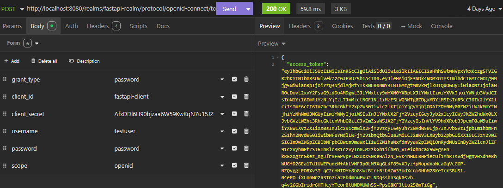
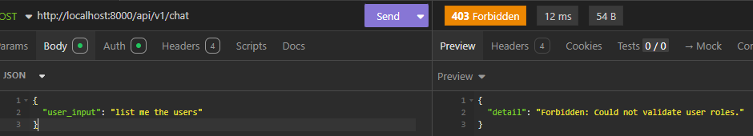
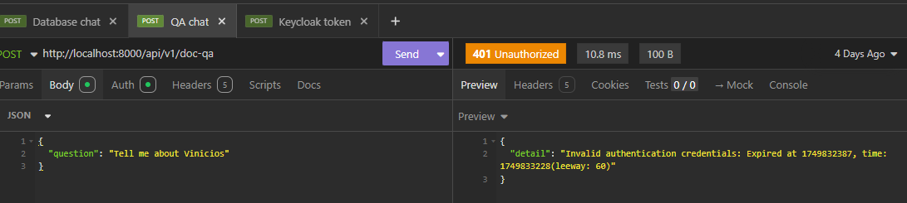

# Guia de Configuração do Keycloak para FastAPI

## 1. Criar o Realm `fastapi-realm`

1. No canto superior esquerdo, abra o dropdown **Master** → **Add realm**.
2. Em **Name**, digite: `fastapi-realm`.
3. Clique em **Create**.

---

## 2. Criar o Client `fastapi-client`

1. No menu lateral, clique em **Clients** → **Create**.
2. **Client ID:** `fastapi-client`
3. **Root URL:** deixe em branco ou coloque a URL da sua API.
4. Clique em **Save**.
5. Em **Settings**:
    - **Access Type:** `confidential`
    - **Valid Redirect URIs:** `*` (ou especifique sua URL exata)
    - **Standard Flow Enabled:** `ON`
    - **Direct Access Grants Enabled:** `ON`
6. Clique em **Save**.
7. Vá em **Credentials** → copie o **Secret**.

---

## 3. Criar as Roles `app-user` e `admin`

1. No menu lateral, vá em **Roles** → **Add role**.
2. **Role Name:** `app-user` → **Save**.
3. Repita para `admin`.

---

## 4. (Opcional) Criar um Usuário de Teste e Atribuir Roles

1. Menu lateral → **Users** → **Add user**
    - **Username:** `joao` (por exemplo)
    - **Email**, **Enabled:** `ON` → **Save**
2. Na tela do usuário, vá em **Role Mappings**:
    - **Available Roles (realm-management):** selecione `app-user` e `admin`
    - Clique em **Add selected**

---

## 5. Arquivo `.env`

Monte seu `.env` exatamente assim (substitua `chavegeradaaqui` pelo secret copiado):

```env
KEYCLOAK_SERVER_URL=http://localhost:8080/
KEYCLOAK_REALM=fastapi-realm
KEYCLOAK_CLIENT_ID=fastapi-client
KEYCLOAK_CLIENT_SECRET=chavegeradaaqui
```

---

## 6. Teste seu Client

Agora, usando sua aplicação (FastAPI ou outra), você pode:

- Obter token via:

  ```
  POST http://localhost:8080/realms/fastapi-realm/protocol/openid-connect/token
  ```

  Com os parâmetros: `client_id`, `client_secret`, `grant_type=password`, `username` e `password`.



- Verificar que o token inclui as roles `app-user` ou `admin` em:

  ```
  realm_access.roles
  ```

  ## 7. Rotas para testar
  Adicione o Token nas requisições para as seguintes rotas:

  
  

  